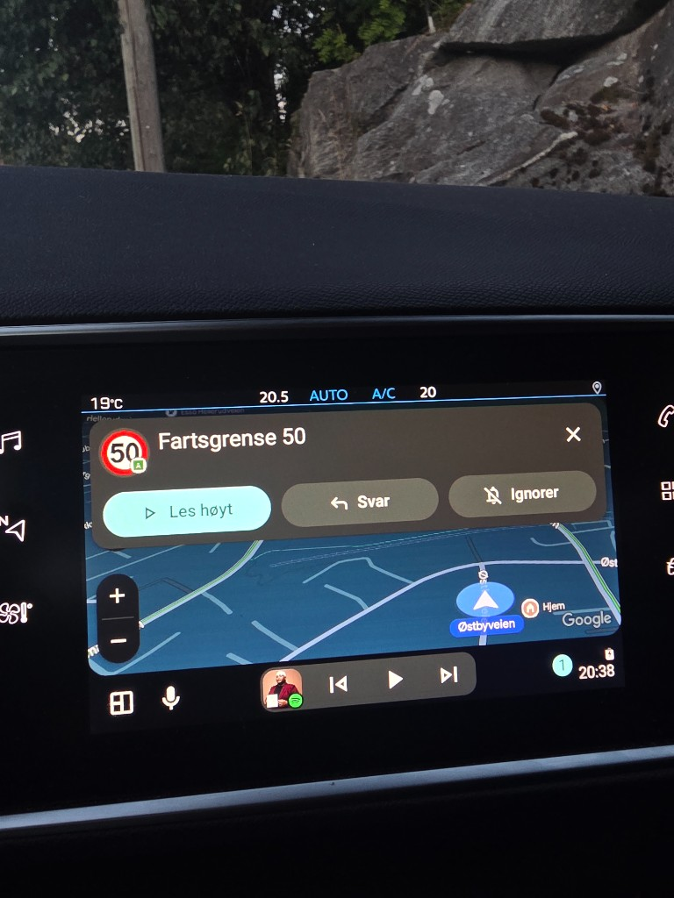
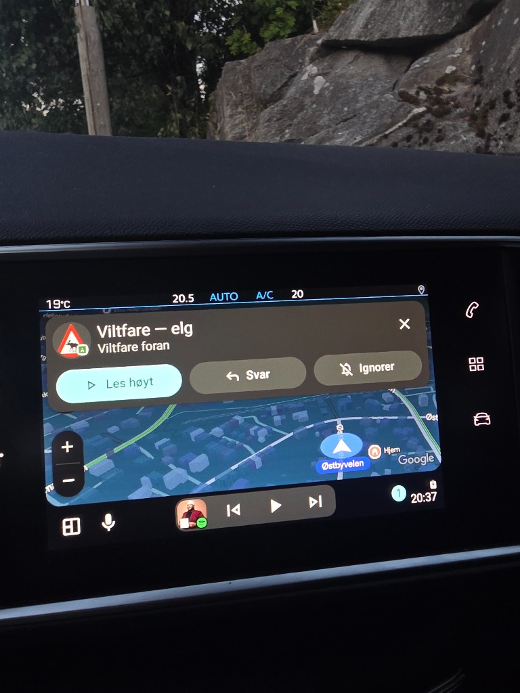
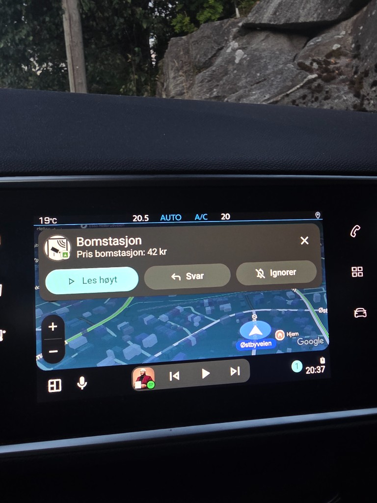
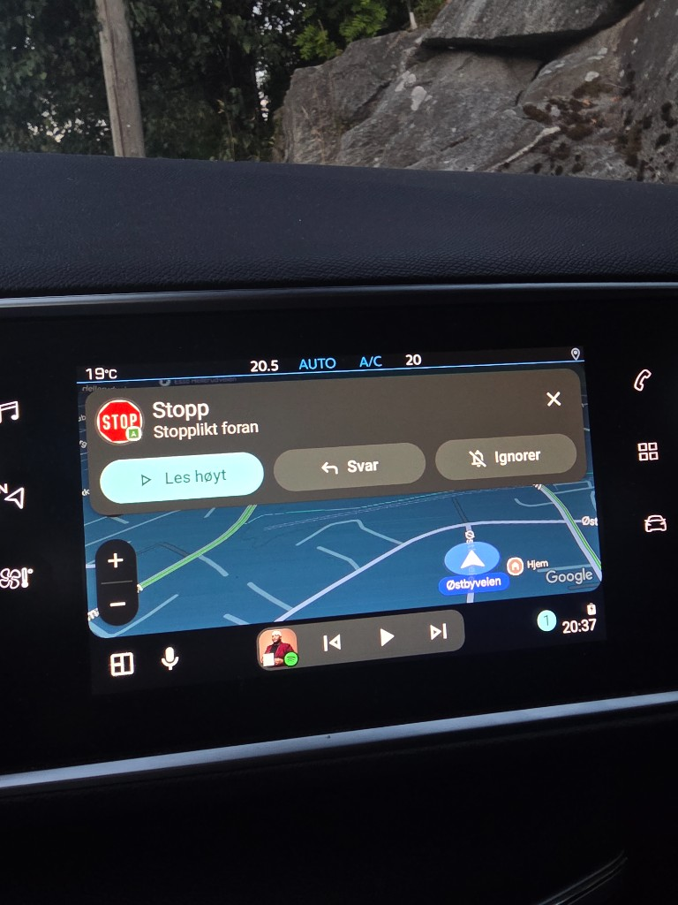

# Vegassistent

Road-sign and hazard alerts while you drive, on the phone and in **Android Auto**. Everything runs on the device — no network is needed once the app is installed.

The app matches GPS to a map of Norwegian road objects (NVDB) and shows a heads-up when something is ahead on the road you are on. The app is still a work in progress, so everything is not perfect yet.

## Screenshots

Heads-up alerts in Android Auto:

### Speed limit

### Wildlife

### Toll station

### Stop sign

## Features

- **Offline alerts** — nationwide signs and road map ship in the app; no internet while driving
- **Android Auto heads-up** — alerts can appear over the map while you navigate
- **Road matching** — alerts follow the road you are on, not nearby side streets. In tunnels and under bridges the app stays on the last known road instead of jumping with GPS
- **Official sign artwork** — Norwegian traffic-sign icons in the notifications

### Tabs

- **Home** — start or stop tracking. Tracking also starts when you open the app.
- **Alerts** — turn each alert type on or off. Choices are remembered.
- **Test** — fire a real notification for any sign type (and a combined priority-road + speed-limit alert) without driving. If Android Auto is connected, the same alert shows in the car. Use this to check that phone and Auto notifications work.
- **Log** — records GPS, road matching, and alerts while tracking is on. Share, copy, or clear the trip log after a drive.

### Alert types

| Type | Examples |
| --- | --- |
| Speed limits | 30–110 km/h |
| Priority road | Start and end of forkjørsvei |
| Speed cameras | Point cameras and average-speed stretches |
| Tolls | Toll stations, with price when available |
| Wildlife | Moose, deer, reindeer, roe deer |
| Rail crossings | Level crossing |
| Ferry | Ferry quay |
| Signs | Stop, sharp curves, road narrowing, tunnel |
| Municipality | Entering a kommune |

## Download and install

Download `app-release.apk` from the [latest release](https://github.com/OlekOlaisen/road-notifications/releases). The file is about **1.4 GB** because the nationwide map and signs are bundled.

1. Allow **Install unknown apps** for your browser or file manager.
2. Open the APK and install.
3. Grant **location** and **notification** permission.

The first launch copies map data onto the phone — keep several GB free. To update, install the new APK over the one you already have.

Requires Android 8.0 or newer.

## Android Auto

The app is sideloaded, so Android Auto must allow unknown sources:

1. Open Android Auto settings on the phone.
2. Enable developer settings (tap the version number repeatedly).
3. Allow unknown sources.
4. Connect to the car and grant location and notification access.
5. Pin Vegassistent on the Android Auto launcher (Customize launcher).

Alerts can then show as heads-up over the map while you navigate.

## Privacy

Location is used only on the phone to match signs and roads. The app does not need an account, analytics, or the cloud to alert.
